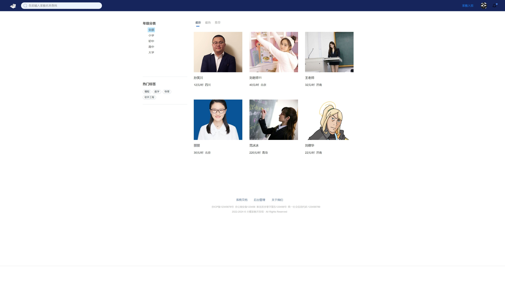

<!--
*** 感谢查看我们的最佳 README 模板，如果你有好的建议，请复刻（fork）本仓库并且创建一个
*** 拉取请求（pull request），或者直接创建一个带「enhancement」标签的议题（issue）。
*** 不要忘记给该项目点一个 star！
*** 再次感谢！现在快去创建一些了不起的东西吧！:D
-->

<!-- 项目 SHIELDS -->
<!--
*** 我们使用了 markdown 「参考风格」的链接以便于阅读。
*** 参考链接是用方括号 [ ] 包围起来的，而非 圆括号 ( )。
*** 请到文档末尾查看 contributors-url、forks-url 等变量的声明。这是一种可选的简洁语法，你可能会想要使用。
*** https://www.markdownguide.org/basic-syntax/#reference-style-links
-->
[![Contributors][contributors-shield]][contributors-url]
[![Forks][forks-shield]][forks-url]
[![Stargazers][stars-shield]][stars-url]
[![Issues][issues-shield]][issues-url]
[![MIT License][license-shield]][license-url]

<!-- 项目 LOGO -->
 

  

<h3 align="center">家教系统</h3>

  

    本项目为家教信息管理平台，提供家教选择，信息管理等功能。
     
    <a href="https://github.com/QR-0W/SDUWH_2024_Web_School/tree/main/docs"><strong>浏览文档 »</strong></a>
     
     
    <a href="https://github.com/QR-0W/SDUWH_2024_Web_School">查看 Demo</a>
    ·
    <a href="https://github.com/QR-0W/SDUWH_2024_Web_School/issues">反馈 Bug</a>
    ·
    <a href="https://github.com/QR-0W/SDUWH_2024_Web_School/issues">请求新功能</a>
  

<!-- 目录 -->

  
目录

  <ol>
    <li>
      <a href="#关于本项目">关于本项目</a>
      <ul>
        <li><a href="#构建工具">构建工具</a></li>
      </ul>
    </li>
    <li>
      <a href="#开始">开始</a>
      <ul>
        <li><a href="#依赖">依赖</a></li>
        <li><a href="#安装">安装</a></li>
      </ul>
    </li>
    <li><a href="#使用方法">使用方法</a></li>
    <li><a href="#路线图">路线图</a></li>
    <li><a href="#贡献">贡献</a></li>
    <li><a href="#许可证">许可证</a></li>
    <li><a href="#联系我们">联系我们</a></li>
    <li><a href="#致谢">致谢</a></li>
  </ol>

<!-- 关于本项目 -->

## 关于本项目

本项目为家教信息管理平台，提供家教检索与推荐，信息管理等功能。

### 构建工具

* [Vue.js](https://vuejs.org/)
* [Bootstrap](https://getbootstrap.com)
* [JDK 1.8](https://www.oracle.com/java/)
* [Springboot](https://spring.io/projects/spring-boot/)

### 			团队分工：​							

林正阳：类图设计文档、标签管理、评论管理、管理协调、答辩材料​		

宦然：分类管理、答辩材料​							

刘灿：用户管理、答辩材料​			

于瑞东：家教管理、运营管理、答辩材料​							

武敬信：需求分析报告、主页面、搜索界面、详细界面、用户中心、答辩材料

安竟豪：数据库设计文档、后端管理全部界面、登录界面、注册界面、答辩材料

<!-- 开始 -->

## 开始

这是一份在本地构建项目的指导的例子。

要获取本地副本并且配置运行，你可以按照下面的示例步骤操作。

### 依赖

- Ant design
- Axios
- Echarts
- Element-plus
- Pinia
- Vite
- JDK 1.8
- Maven
- Spring
- Spring MVC
- Springboot 
- MyBatis
- Druid
- MySQL
- Redis
- Servlet

### 安装

#### 后端

- 配置依赖项

- 配置后端端口、DB_NAME、BASE_LOCATION，位于 `application.yml`

- 修改 LOG_HOME 的 value 值，位于 `logback-spring.xml`

- 配置 JDK

  

#### 前端

- 配置依赖项

<!-- 使用方法 示例 -->

## 使用方法

启动后端项目，在前端根目录下运行 `npm run dev` ，启动网页。

<!-- 路线图 -->

## 路线图

- [x] 数据库创建
- [x] 后端创建 Service - Controller - Mapper 层
- [x] 后端开放接口
- [x] 前端利用Vue +Ant design创建基础界面
- [x] 实现邮箱验证码功能
- [x] 用户头像显示动态更新
- [ ] 绑定手机号和安全验证

到 [open issues](https://github.com/QR-0W/SDUWH_2024_Web_School/issues) 页查看所有请求的功能 （以及已知的问题）。

<!-- 贡献 -->

## 贡献

贡献让开源社区成为了一个非常适合学习、互相激励和创新的地方。你所做出的任何贡献都是**受人尊敬**的。

如果你有好的建议，请复刻（fork）本仓库并且创建一个拉取请求（pull request）。你也可以简单地创建一个议题（issue），并且添加标签「enhancement」。不要忘记给项目点一个 star！再次感谢！

1. 复刻（Fork）本项目
2. 创建你的 Feature 分支 (`git checkout -b feature/AmazingFeature`)
3. 提交你的变更 (`git commit -m 'Add some AmazingFeature'`)
4. 推送到该分支 (`git push origin feature/AmazingFeature`)
5. 创建一个拉取请求（Pull Request）

<!-- 许可证 -->

## 许可证

打开 [LICENSE.txt](LICENSE.txt) 查看更多内容。

<!-- 联系我们 -->

## 联系我们

项目链接: [https://github.com/QR-0W/SDUWH_2024_Web_School](https://github.com/QR-0W/SDUWH_2024_Web_School)

<!-- 致谢 -->

## 致谢

* [othneildrew README Template](https://github.com/othneildrew/Best-README-Template)
* [ChatGPT](https://chatgpt.com/)

<!-- MARKDOWN 链接 & 图片 -->
<!-- https://www.markdownguide.org/basic-syntax/#reference-style-links -->

[contributors-shield]: https://img.shields.io/github/contributors/QR-0W/SDUWH_2024_Web_School?style=for-the-badge
[contributors-url]: https://github.com/QR-0W/SDUWH_2024_Web_School/graphs/contributors
[forks-shield]: https://img.shields.io/github/forks/QR-0W/SDUWH_2024_Web_School?style=for-the-badge
[forks-url]: https://github.com/QR-0W/SDUWH_2024_Web_School/network/members
[stars-shield]: https://img.shields.io/github/stars/QR-0W/SDUWH_2024_Web_School?style=for-the-badge
[stars-url]: https://github.com/QR-0W/SDUWH_2024_Web_School/stargazers
[issues-shield]: https://img.shields.io/github/issues/QR-0W/SDUWH_2024_Web_School?style=for-the-badge
[issues-url]: https://github.com/QR-0W/SDUWH_2024_Web_School/issues
[license-shield]: https://img.shields.io/github/license/QR-0W/SDUWH_2024_Web_School?style=for-the-badge
[license-url]: https://github.com/QR-0W/SDUWH_2024_Web_School/blob/master/license.txt
[linkedin-shield]: https://img.shields.io/badge/-LinkedIn-black.svg?style=for-the-badge&logo=linkedin&colorB=555
[linkedin-url]: https://linkedin.com/in/linkedin_username
[product-screenshot]: images/screenshot.png

