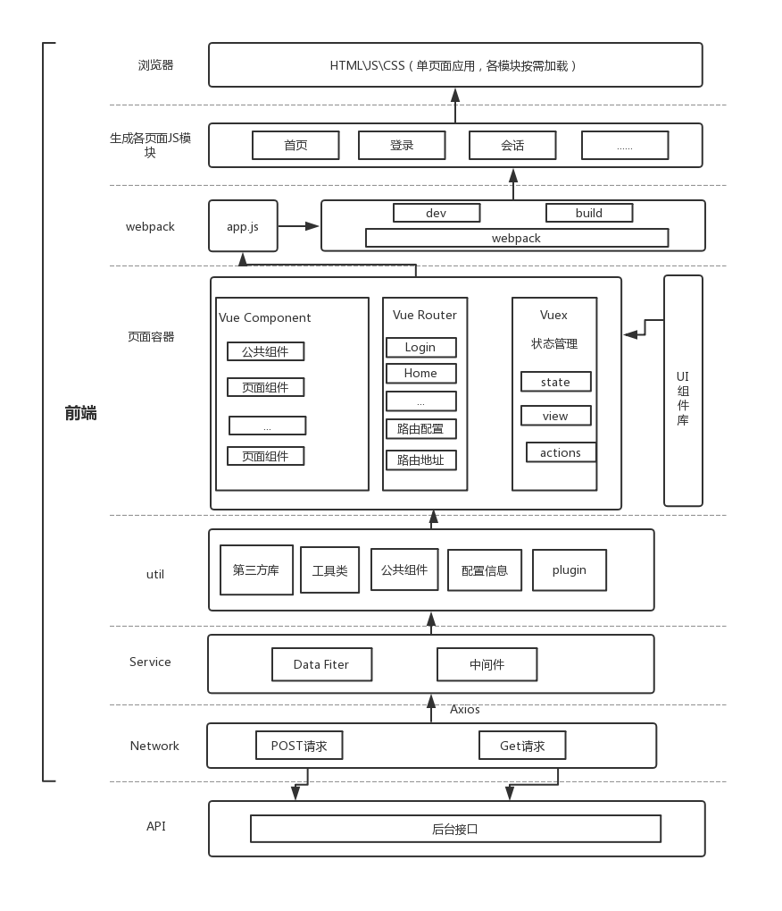

#### 常见问题

##### 变量
https://blog.csdn.net/qq_41636947/article/details/117907448

##### antd的css引入方式
在index.html里面引入的cdn

##### cdn
https://cdn.jsdelivr.net/npm/ant-design-vue@3.2.20/dist/
https://cdn.staticfile.org/ant-design-vue/3.2.20/antd.min.css

#### public文件夹内容在build后会自动打到dist中
