    

        
    

     
    

        
	

    
家教系统需求分析&emsp;&emsp;

    
&emsp;&emsp;

    <table style="border:none; width: 80%; font-family: '仿宋'; margin-top: 2rem;">
    <tbody style="font-size: 16pt;">
    	<tr style="font-weight:bold;"> 
    		<td style="width: 25%; text-align:right;">课程名称</td>
    		<td style="width: 5%;">：</td> 
    		<td style="font-weight:normal; border-bottom: 2px solid; text-align:center;">项目实训</td>     </tr>
        <tr style="font-weight:bold;"> 
    		<td style="width: 25%; text-align:right;">姓&emsp;&emsp;名</td>
    		<td style="width: 5%;">：</td> 
    		<td style="font-weight:normal; border-bottom: 2px solid; text-align:center;">武敬信</td>     </tr>
    	<tr style="font-weight:bold;"> 
    		<td style="width: 25%; text-align:right;">学&emsp;&emsp;号</td>
    		<td style="width: 5%;">：</td> 
    		<td style="font-weight:normal; border-bottom: 2px solid; text-align:center;">202000800525</td>     </tr>
        <tr style="font-weight:bold;"> 
    		<td style="width: 25%; text-align:right;">专业班级</td>
    		<td style="width: 5%;">：</td> 
    		<td style="font-weight:normal; border-bottom: 2px solid; text-align:center;">21软件工程1班</td>     </tr>
    	<tr style="font-weight:bold;"> 
    		<td style="width: 25%; text-align:right;">授课教师</td>
    		<td style="width: 5%;">：</td> 
    		<td style="font-weight:normal; border-bottom: 2px solid; text-align:center;">张亚峰</td>     </tr>
    </tbody>              
    </table>
    
2024 年 7 月 11 日

------

[TOC]

------

# 系统需求分析

## 项目介绍

本系统主要是以现实生活中的家教服务平台为依据，创建一个提供网上家教登记与管理的平台，意在建立一个高效率、高可信度、更加方便的网络家教服务。借助计算机进行为用户提供合适的家教信息，同时简洁大方地展示不同家教的详细信息，很大程度上提高用户进行分析和选择的效率。平台实现了家教查询系统，提高用户查询订单和预约家教的速度，同时给予家教人员和平台管理者一个方便快捷的管理平台，通过平台实现对于家教信息的增删查改等操作。通过这份需求报告，详细说明了该软件的需求规格以及产品定义。

## 项目用户

在家教系统的项目中，存在多种类型的用户。每个用户角色在系统中扮演不同的角色和功能，具有不同的权限和操作能力。这些用户角色之间的交互和合作将构成系统的整体功能。在项目开发过程中，需要详细定义每个用户角色的需求和期望，以确保系统能够满足各种用户的需求。

因此根据总体需求分析，以下是系统可能的用户角色：

### 用户

用户是家教预约管理系统的主要用户群体。

用户可以通过系统浏览家教信息、预约家教服务。

用户可以管理个人信息、查看预约历史记录等。

用户可以选择注册成为家教，提供教育服务。

### 家教

家教是注册成为教育服务提供者的用户。

家教可以在系统中管理个人信息和服务项目。

家教可以查看并管理收到的预约请求，提供服务状态更新。

### 管理员

管理员是系统的后台管理者。

管理员负责管理家教、用户、预约和系统等信息。

管理员可以添加、编辑和删除用户信息，处理用户反馈，监控系统运行情况等。

## 项目功能

当针对不同用户群体设计家教系统的详细功能需求时，可以进一步拆分和详细描述每个用户角色的功能需求，具体如下：

### 用户功能需求：

**用户注册和登录**：

- 允许用户创建新账户并提供必要的个人信息。
- 用户可以通过用户名和密码登录系统。
- 支持第三方登录选项（如使用社交媒体账户进行登录）。

**家教浏览和搜索**：

- 提供用户友好的家教信息界面，按照分类展示家教。
- 允许用户使用关键字搜索家教。
- 显示家教的详细信息，包括姓名、简介、服务内容、价格和评分等。

**家教预约**：

- 支持用户查看家教的空闲时间，并联系家教。

**支付和预约确认**：

- 提供多种支付方式，如信用卡、支付宝、微信支付等。
- 显示预约总金额和详细信息，包括家教服务内容、时长和价格。
- 用户可以确认预约并完成支付。

**账户管理**：

- 允许用户编辑个人资料，如姓名、联系方式和地址。
- 提供修改密码和找回密码的功能。

### 家教功能需求

**个人信息管理**：

- 家教可以在系统中注册并管理个人信息和服务项目。
- 家教可以更新自己的简介、服务内容和价格等信息。

**预约管理**：

- 家教可以查看并管理收到的预约请求。
- 提供预约确认、取消和服务状态更新功能。

**服务状态更新**：

- 家教可以更新服务状态。
- 提供实时服务进度更新给用户。

**账户管理**：

- 家教可以查看自己的服务历史记录。
- 管理个人资料和服务项目。

### 管理员功能需求

**用户管理**：

- 管理用户账户，包括查看用户信息、禁用账户和解锁账户等。
- 提供权限管理，如管理员、普通用户、家教等角色区分。
- 管理员可以添加、编辑和删除家教信息。
- 审核家教的注册申请和资质。

**系统监控和报告**：

- 监控系统运行状况，包括服务器状态、数据库连接和性能指标等。
- 生成报告，如家教服务排行、用户活跃度等分析数据。

**分类和标签管理**：

- 运营人员可以管理家教分类和标签信息。
- 添加、编辑和删除分类和标签。

**评论管理**：

- 运营人员可以审核和管理用户对家教服务的评论。
- 处理不当评论并进行适当操作。

**统计分析**：

- 运营人员可以查看并分析系统中的各类数据。
- 生成运营报告，提供决策支持。

### 功能表

| 属性\功能  | 功能点         | 功能描述                     |
| ---------- | -------------- | ---------------------------- |
| 用户需求   | 登录系统       | 输入账号进行验证             |
|            | 家教浏览和搜索 | 浏览和搜索家教信息           |
|            | 家教预约       | 预约家教服务并选择时间和地点 |
|            | 支付和预约确认 | 提供多种支付方式并确认预约   |
|            | 预约管理       | 查看和管理预约状态           |
|            | 账户管理       | 编辑个人资料，修改密码等     |
| 家教需求   | 个人信息管理   | 管理个人信息和服务项目       |
|            | 预约管理       | 查看和管理收到的请求         |
|            | 服务状态更新   | 更新服务状态                 |
| 管理员需求 | 用户管理       | 管理用户账户，权限区分等     |
|            | 家教管理       | 审核和管理家教信息           |
|            | 预约管理       | 查看所有预约并处理           |
|            | 分类和标签管理 | 管理家教分类和标签信息       |
|            | 评论管理       | 审核和管理用户评论           |

### 各类及其属性

### 类间关系图

### 用例图

### 流程图

## 功能需求分析

### 用户登录注册

只有注册用户才可以使用该平台，新用户可通过电子邮件注册账号，成功后可以设置个性化的用户名以及头像。登录用户可以自动登录。用户可以选择绑定支付方式，还可以收藏自己喜欢的家教。在每次家教服务完成后，用户可以对家教进行评价和打分。

### 家教浏览和搜索

用户可以通过系统浏览和搜索家教信息。家教信息按照科目等分类展示，用户可以使用关键字进行搜索。每个家教信息页面包括家教的简介、服务内容、价格和评分等详细信息，用户可以根据这些信息选择合适的家教。

### 家教预约

用户可以选择家教并预约家教服务。预约时，用户可以选择家教的服务时间和地点，填写相关需求。系统将根据家教的空闲时间自动匹配并确认预约，用户可以在预约确认后收到通知。

### 支付和预约确认

用户可以通过多种支付方式支付家教服务费用，如银行卡、支付宝、微信支付等。系统显示预约的总金额和详细信息，包括家教服务内容、时长和价格。用户在确认预约并完成支付后，可以查看支付和预约确认信息。

### 预约管理

用户可以查看和管理自己的预约状态，包括待确认、已确认、进行中、已完成和已取消等状态。用户可以在预约管理页面查看预约详情，修改或取消未处理的预约。

### 账户管理

用户可以编辑个人资料，包括修改用户名、头像、联系方式和地址等信息。用户可以设置和修改密码，并使用找回密码功能重置密码。用户还可以查看和管理绑定的支付方式，提供反馈和评价家教服务。

### 家教注册和信息管理

家教可以在系统中注册账号，并填写个人信息和服务项目。注册成功后，家教可以管理自己的个人资料，更新简介、服务内容和价格等信息。家教可以查看并管理收到的预约请求，确认或取消预约，并更新服务状态。

### 订单处理

管理员可以查看所有订单，并根据需要处理订单。管理员可以修改订单状态，如确认、取消、进行中和已完成等操作。系统生成报表和分析数据，包括订单数量、交易额和用户评价等统计信息。

### 用户管理

管理员负责管理用户账户，包括查看用户信息、禁用账户和解锁账户等。管理员可以添加、编辑和删除用户信息，设置用户权限，如管理员、普通用户和家教等角色区分。

### 科目管理

管理员可以管理系统中的科目信息，包括添加、编辑和删除科目。管理员可以设置科目的名称、描述和分类，确保系统中的科目信息准确和更新。

### 评论管理

管理员可以审核和管理用户对家教服务的评论。管理员可以查看、编辑和删除不当评论，并根据用户反馈进行适当处理。系统生成评论分析报告，帮助管理员优化用户体验。

### 统计分析

运营人员可以查看并分析系统中的各类数据，生成运营报告。报告包括家教服务排行、用户活跃度、订单数量、交易额等统计信息，提供决策支持，帮助优化系统运营和用户体验。

## 其他需求分析

### 非功能性需求

性能要求：系统应能在高负载情况下保持快速响应，页面加载时间不超过3秒，同时支持同时处理1000个并发用户。

安全需求：用户密码应以哈希方式存储，并通过HTTPS协议传输用户登录和支付信息。系统应有防止SQL注入、跨站点脚本攻击（XSS）和跨站请求伪造（CSRF）等安全措施。

可靠性要求：系统应具备容错能力，能够处理网络故障和服务器故障的情况。系统应能够在故障恢复后恢复正常运行。

可维护性要求：系统应具备可扩展性，以便将来能够添加新的功能模块和服务内容。系统应模块化设计，便于维护和测试。

用户界面需求：用户界面应简洁明了，易于使用。界面元素应具备一致的风格和布局，符合用户的使用习惯。

### 数据需求

数据模型：系统应包括用户信息、家教信息、预约信息和评价信息等实体，并定义它们之间的关系。

数据存储和管理：系统将使用关系型数据库（如MySQL）进行数据存储。数据库应具备高可用性和数据备份机制，以保证数据的安全性和可靠性。

数据一致性：系统应实现事务管理，保证多个操作的一致性。系统应具备并发控制机制，以避免数据冲突和脏数据。

### 系统界面和交互设计

用户界面设计：用户界面应具备简洁明了的布局，方便用户浏览家教信息、预约服务和管理账户。界面元素应符合现代化的设计风格，并适配不同屏幕尺寸的设备。

交互设计：系统应提供直观的导航、预约流程和订单管理操作，以确保用户能够顺利完成各项操作并获得及时反馈。

### 验收标准和测试要求

验收标准：系统将在验收阶段进行功能验证，确认系统能够满足需求文档中的功能需求，并符合用户的期望。

测试策略和用例：测试团队将制定功能测试、性能测试和安全测试的策略，并编写相应的测试用例来验证系统的功能和性能。

### 部署和运维要求

系统部署：系统将部署在云服务器上，使用Linux操作系统。系统的数据库将进行定期备份，以保证数据的安全性和可恢复性。

运维支持：系统将设置监控机制，定期检查系统的运行状况和性能指标。同时，系统将记录日志，以便追踪和解决潜在的问题。

### 项目计划和里程碑

项目计划：项目将按照以下阶段进行：需求分析、系统设计、开发、测试、部署和验收。每个阶段将有相应的时间安排和目标。

里程碑：关键里程碑包括需求分析完成、系统设计完成、开发完成、测试完成和系统交付等。每个里程碑标志着项目的重要进展和阶段完成。

## 需求分析小结

此需求分析文档对家教系统的功能和需求进行了详细分析，从用户角度出发，涵盖了多个用户群体的需求。文档包括以下主要内容：

**用户群体分析：**

对不同用户群体（普通用户、商家、管理员）进行了分析，了解他们的需求和行为模式。

以下是用户角色与功能需求表：

| 用户角色   | 功能需求                 |
| ---------- | ------------------------ |
| 普通用户   | 用户注册和登录           |
|            | 浏览家教信息和搜索家教   |
|            | 预约家教服务             |
|            | 支付和预约确认           |
|            | 预约管理和查看历史预约   |
|            | 评价家教服务             |
| 家教用户   | 家教注册和登录           |
|            | 管理个人信息和服务项目   |
|            | 查看和管理收到的预约请求 |
|            | 更新服务状态             |
| 管理员用户 | 管理用户账户和权限       |
|            | 管理家教信息和审核       |
|            | 处理订单和反馈           |
|            | 管理科目信息             |
|            | 审核和管理用户评论       |

**功能需求分析**：

针对不同用户群体提出了具体的功能需求，包括用户注册和登录、浏览家教信息、预约家教、支付和预约确认、预约管理、评价家教服务、家教信息管理、订单处理、用户管理和系统监控等。

**非功能性需求分析**：

定义了系统的性能要求、安全需求、可靠性要求、可维护性要求和用户界面需求，以确保系统的稳定性、安全性和易用性。

以下是系统功能模块与非功能性需求表：

| 功能模块   | 非功能性需求                                 |
| ---------- | -------------------------------------------- |
| 用户管理   | 用户注册信息应包含用户名、密码和联系方式     |
|            | 系统应支持用户密码的加密存储                 |
|            | 用户登录信息应验证用户身份                   |
| 家教管理   | 系统应支持家教信息的分类和标签               |
|            | 家教资料应支持上传和展示                     |
|            | 家教能够添加和编辑个人信息及服务内容         |
| 预约管理   | 用户能够查看预约状态和历史预约记录           |
|            | 家教能够处理预约请求和更新预约状态           |
|            | 系统提供通知功能，提醒用户预约状态变更       |
| 系统安全性 | 用户密码应进行加密存储                       |
|            | 系统对用户输入进行合法性验证                 |
|            | 管理员用户应具备特殊权限，用于管理用户和家教 |
| 用户界面   | 界面应简洁明了，易于导航和操作               |
|            | 界面设计应符合用户习惯和可用性原则           |
|            | 系统应支持不同设备上的响应式布局             |

**数据需求分析**：

描述了系统的数据模型和数据管理要求，包括用户信息、家教信息、预约信息和评价信息等的存储和关系。系统将使用关系型数据库（如MySQL）进行数据存储。数据库应具备高可用性和数据备份机制，以保证数据的安全性和可靠性。系统应实现事务管理，保证多个操作的一致性。系统应具备并发控制机制，以避免数据冲突和脏数据。

**系统界面和交互设计**：

对用户界面的设计提出了要求，包括简洁明了的布局和直观的交互操作，以提供良好的用户体验。用户界面应具备简洁明了的布局，方便用户浏览家教信息、预约服务和管理账户。系统应提供直观的导航、预约流程和订单管理操作，以确保用户能够顺利完成各项操作并获得及时反馈。

**验收标准和测试要求**：

确定了系统验收的标准和测试策略，以确保系统功能的正确性和性能的稳定性。

 

**部署和运维要求**：

提出了系统部署和运维的要求，包括云服务器部署、数据备份、监控和日志记录等。

 

通过这份需求分析文档，项目团队能够更清晰地了解项目的范围和目标，为后续的系统设计和开发提供了指导。同时，文档也有助于与利益相关者沟通和达成共识，确保项目能够按照用户期望和业务需求进行开发。

